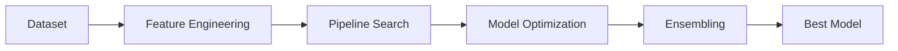
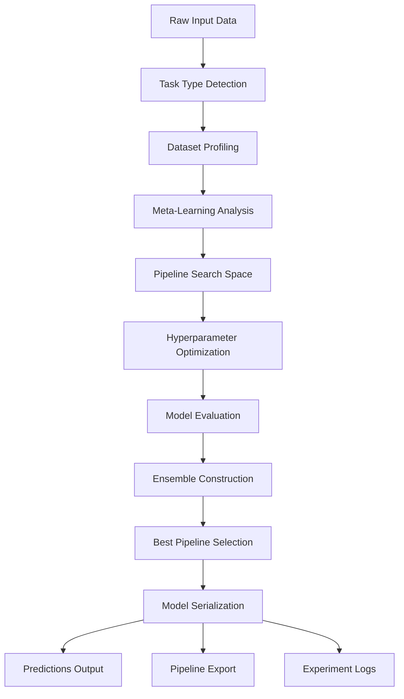

# ⚡ AutoForge — Research-Grade AutoML Engine

> Build, optimize, and deploy machine learning pipelines automatically.


---

### 🧠 Self-Improving AutoML

AutoForge continuously learns from past experiments and adapts its search strategy.

- Prioritizes high-performing models automatically  
- Avoids poor preprocessing choices  
- Improves performance over time  

This creates a **feedback loop where AutoML becomes smarter with usage**

---

## 🚀 Features

* 🔍 **Full Pipeline Search** (Preprocessing + Model + Features)
* ⚡ **Hyperparameter Optimization** (Optuna powered)
* 🧠 **Meta-Learning Engine** (learns from past runs)
* 📊 **Experiment Tracking System**
* 🧩 **Dynamic Feature Engineering**
* 🤖 **Multi-Model Ensembling (Stacking + Blending)**
* 💻 **CLI Interface for Production Use**

---

## 🧠 Architecture


---
## Data Flow Pipeline



---

## ⚙️ Installation

```bash
git clone https://github.com/YOUR_USERNAME/autoforge.git
cd autoforge
pip install -e .
```

---

## 🚀 Quick Start

```bash
automl train data.csv --target price
automl predict model.pkl test.csv
automl logs
```

---

## 📊 Example

```python
from automl.api.automl import AutoML

automl = AutoML(n_trials=50)
automl.fit(X, y)

preds = automl.predict(X_test)
```

---

## 🧠 What Makes AutoForge Special?

Unlike basic AutoML tools, AutoForge:

* Searches **entire pipelines**, not just models
* Learns from previous datasets (**meta-learning**)
* Combines models using **stacking & blending**
* Tracks experiments for reproducibility

---

## 🔥 Roadmap

* [ ] Neural Architecture Search (NAS)
* [ ] Streamlit Dashboard
* [ ] Distributed AutoML (Ray)
* [ ] PyPI Package Release

---

## 🤝 Contributing

Pull requests are welcome. For major changes, open an issue first.

---

## ⭐ Support

If you like this project, give it a ⭐ on GitHub!


flowchart TD
    A[Raw Input Data] --> B[Task Type Detection]
    B --> C[Dataset Profiling]
    C --> D[Meta-Learning Analysis]
    D --> E[Pipeline Search Space]
    E --> F[Hyperparameter Optimization]
    F --> G[Model Evaluation]
    G --> H[Ensemble Construction]
    H --> I[Best Pipeline Selection]
    I --> J[Model Serialization]
    
    J --> K[Predictions Output]
    J --> L[Pipeline Export]
    J --> M[Experiment Logs]